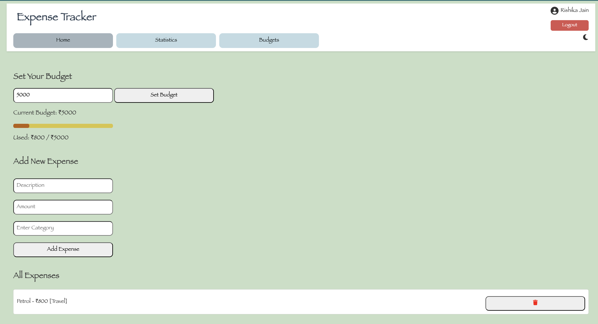
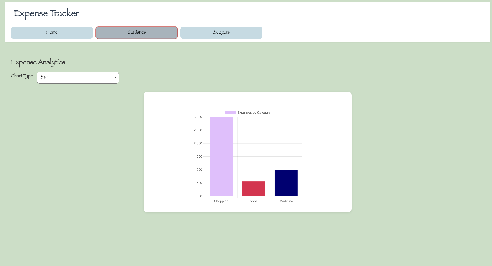
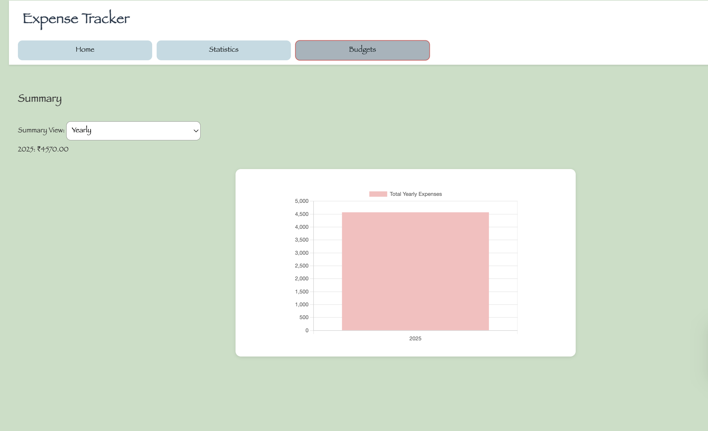

# 💸 Expense Tracker with Firebase & Chart.js

[](https://firebase.google.com/)
[](https://github.com/rishikajn191/ExpenseTracker/actions)
[](LICENSE)
[](https://github.com/rishikajn191/ExpenseTracker/commits/main)


A modern web application to track daily, monthly, and yearly expenses with budget visualization and analytics. Built using HTML, CSS, JavaScript, Firebase Firestore, Chart.js, and deployed via GitHub Actions & Firebase Hosting.

## Table of Contents

- [Highlights](#-highlights)
- [Live Site](#live-site)
- [Repository](#repository)
- [Demo](#demo)
- [Features](#features)
- [Project Setup](#project-setup)
- [Folder Structure](#folder-structure)
- [Deployment (CI/CD)](#deployment-cicd)
- [GitHub Actions: Firebase Hosting CI/CD](#github-actions-firebase-hosting-cicd)
- [Tech Stack](#tech-stack)
- [Future Improvements](#future-improvements)
- [Testing Instructions](#testing-instructions)
- [License](#license)
- [Author](#author)

## Highlights
- Secure Firebase Config via GitHub Secrets
- Interactive analytics with Chart.js
- GitHub Actions CI/CD for automated deployment
- Real-time Firestore integration

## Live Site:
👉 https://expensetracker-5bddb.web.app/

## Repository:
👉 https://github.com/rishikajn191/ExpenseTracker

## Demo
Here’s what the Expense Tracker looks like:




---

## Features
- Add, delete, and categorize expenses
- Set and track monthly budget
- View dynamic Pie and Bar charts (Chart.js)
- Toggle summary by daily/monthly/yearly
- Real-time updates using Firebase Firestore
- Persistent budget saved in localStorage
- Deployed using GitHub Actions CI/CD
- Firebase config injected securely via GitHub Secrets

---

## Project Setup
To run locally:
1. Clone the repository:
   ```bash
   git clone https://github.com/rishikajn191/ExpenseTracker.git
   cd ExpenseTracker
   ```
2. Install Firebase CLI (if not already):
   ```bash
   npm install -g firebase-tools
   ```
3. Add your Firebase config:
- Copy public/firebase-config.template.js → public/firebase-config.js
- Replace variables with your actual Firebase values
  ```js
   const firebaseConfig = {
     apiKey: "YOUR_API_KEY",
     authDomain: "YOUR_AUTH_DOMAIN",
     projectId: "YOUR_PROJECT_ID",
     storageBucket: "YOUR_STORAGE_BUCKET",
     messagingSenderId: "YOUR_MSG_ID",
     appId: "YOUR_APP_ID"
   };
   firebase.initializeApp(firebaseConfig);
   const db = firebase.firestore();
  ```
4. Serve locally:
   ```bash
   firebase emulators:start
   ```
   
---

## Folder Structure
```text
ExpenseTracker/
├── public/
│   ├── index.html                  # Main HTML structure
│   ├── style.css                   # Styling for the app
│   ├── script.js                   # JS logic for charts, budget, CRUD
│   ├── firebase-config.js          # Generated from GitHub Secrets (not committed)
│   ├── firebase-config.template.js # Firebase config template with env placeholders
│   └── assets/
│       ├── screenshot-home.png
│       ├── screenshot-statistics.png
│       └── screenshot-budgets.png
├── .github/
│   └── workflows/
│       └── deploy.yml              # GitHub Actions workflow for Firebase deployment
├── .gitignore
├── firebase.json                   # Firebase Hosting configuration
├── LICENSE
└── README.md
```

---

## Deployment (CI/CD)
Deployment is fully automated using GitHub Actions. Here's how it works:
- Secrets are securely injected using GitHub Actions Secrets  
- A dynamic firebase-config.js is generated from firebase-config.template.js using envsubst  
- Any push to the main branch triggers automatic deployment to Firebase Hosting
### Live URLs
- Production <br>
  👉 https://expensetracker-5bddb.web.app/
- Preview/Test <br>
  👉 https://expensetracker-5bddb.firebaseapp.com/

---

## GitHub Actions: Firebase Hosting CI/CD
Make sure to add the following secrets in your GitHub repository settings:
- FIREBASE_API_KEY  
- FIREBASE_AUTH_DOMAIN  
- FIREBASE_PROJECT_ID  
- FIREBASE_STORAGE_BUCKET  
- FIREBASE_MESSAGING_SENDER_ID  
- FIREBASE_APP_ID  
- FIREBASE_TOKEN (generated via firebase login:ci) <br>
These secrets are used to dynamically generate your Firebase config file during deployment.
### Workflow file:  
.github/workflows/deploy.yml
### How it works:
- envsubst replaces variables in firebase-config.template.js to create a secure firebase-config.js file
- firebase deploy is triggered using GitHub Actions
- Secrets never touch the repo or version control <br>
This setup ensures secure, scalable, and hands-free deployment with every update.

---

## Tech Stack
- HTML5, CSS3, JavaScript (Vanilla ES6)
- Firebase:
     - Firestore (Database)
     - Firebase Hosting
- Chart.js (for interactive data visualizations)
- GitHub Actions (for automated CI/CD deployment)

### Technologies Used


---

## Future Improvements
- User authentication (email/password or Google login)
- Monthly spending summary dashboard
- Export to CSV or Excel
- Responsive design enhancements for tablets/mobiles
- Notifications for overspending

---

## Testing Instructions
Currently, the app is manually tested. Future enhancements may include:
- Unit testing for input validation
- Integration tests for Firestore CRUD operations
- Visual regression tests for chart rendering
- GitHub Action workflow to test before deployment

---

## License
This project is licensed under the MIT License. <br>
Feel free to fork, modify, and share! <br>
See the LICENSE file for more details.

---

## Author
***Rishika Jain*** <br>
Computer Science Engineer <br>
**Leetcode:** https://leetcode.com/u/rishikajn/ <br>
**LinkeldIn:** https://www.linkedin.com/in/rishikajain191/ <br>
**Github:** https://github.com/rishikajn191
**Email:** rishika.jn191@gmail.com
