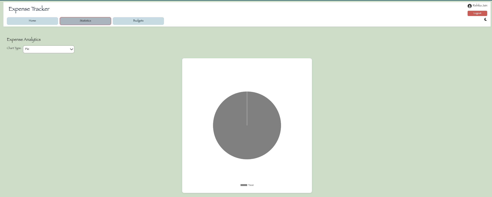
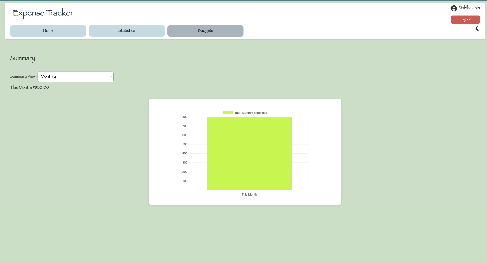

# 💸 Expense Tracker with Firebase & Chart.js

[](https://firebase.google.com/)
[](https://github.com/rishikajn191/ExpenseTracker/actions)
[](LICENSE)
[](https://github.com/rishikajn191/ExpenseTracker/commits/main)
<br>
A responsive and secure web application to track personal expenses with real-time analytics, smart budgeting, and user-specific dashboards. Built with Vanilla JavaScript, Firebase Authentication & Firestore, Chart.js for visualizations, and deployed via GitHub Actions with CI/CD. Designed to showcase full-stack frontend skills, real-time data handling, and scalable Firebase integration.

## Table of Contents

- [Highlights](#-highlights)
- [Live Site](#live-site)
- [Repository](#repository)
- [Demo](#demo)
- [Features](#features)
- [Project Setup](#project-setup)
- [Folder Structure](#folder-structure)
- [Deployment (CI/CD)](#deployment-cicd)
- [GitHub Actions: Firebase Hosting CI/CD](#github-actions-firebase-hosting-cicd)
- [Tech Stack](#tech-stack)
- [Future Improvements](#future-improvements)
- [Testing Instructions](#testing-instructions)
- [License](#license)
- [Author](#author)

## Highlights
- Secure Firebase Config via GitHub Secrets
- Firebase Authentication (Email/Password & Google Sign-In)
- Interactive analytics with Chart.js
- GitHub Actions CI/CD for automated deployment
- Real-time Firestore integration

## Live Site:
👉 _https://expensetracker-5bddb.web.app/_

## Repository:
👉 _https://github.com/rishikajn191/ExpenseTracker_

## Demo
### Demo Account
To help recruiters and testers, a default demo account is configured:
- **Email:** _demo@user.com_
- **Password:** _demo123_

### Screenshots:





---

## Features
- **Firebase Authentication:** Email/Password Login & Google Sign-In
- Add, delete, and categorize expenses
- Set and track budget (with alert on over-spending)
- View dynamic Pie and Bar charts (Chart.js)
- Daily, Monthly, and Yearly Summary Toggle
- Real-time data sync with Firestore (user-specific data under `users/{uid}/expenses`)
- Smart Budget Alert Notifications
- User Avatar/Name display after login
- Public Demo Login for Recruiters
- Firebase Hosting with GitHub Actions (CI/CD)
- Dark Mode toggle for better UX

---

## Project Setup
To run locally:
1. **Clone the repository:**
   ```bash
   git clone https://github.com/rishikajn191/ExpenseTracker.git
   cd ExpenseTracker
   ```
2. **Install Firebase CLI (if not already):**
   ```bash
   npm install -g firebase-tools
   ```
3. **Add your Firebase config:**
- Copy _public/firebase-config.template.js_ → _public/firebase-config.js_
  ```bash
  cp public/firebase-config.template.js public/firebase-config.js
   ```
- Replace variables with your actual Firebase values
  ```js
   const firebaseConfig = {
     apiKey: "YOUR_API_KEY",
     authDomain: "YOUR_AUTH_DOMAIN",
     projectId: "YOUR_PROJECT_ID",
     storageBucket: "YOUR_STORAGE_BUCKET",
     messagingSenderId: "YOUR_MSG_ID",
     appId: "YOUR_APP_ID"
   };
   firebase.initializeApp(firebaseConfig);
   const db = firebase.firestore();
  ```
4. **Serve locally:**
   ```bash
   firebase emulators:start
   ```
5. **Enable Firebase Authentication:**
   - Go to Firebase Console → Authentication → Sign-in method
   - Enable Email/Password and Google providers
6. Add `auth.js` for handling login, registration, Google Sign-In, and forgot password.
7. Serve via Live Server or Firebase (Google login won't work on `file://`)
   ```bash
   npm install -g live-server
   live-server public/
   ```
   
---

## Folder Structure
```text
ExpenseTracker/
├── public/
│   ├── index.html                  # Main HTML structure
│   ├── style.css                   # Styling for the app
│   ├── script.js                   # JS logic for charts, budget, CRUD
│   ├── login.html                  # Separate login page
│   ├── login.css
│   ├── auth.js                     # Handles Firebase auth logic
│   ├── firebase-config.js          # Generated from GitHub Secrets (not committed)
│   ├── firebase-config.template.js # Firebase config template with env placeholders
│   └── assets/
│       ├── screenshot-login.png
│       ├── screenshot-home.png
│       ├── screenshot-statistics.png
│       └── screenshot-budgets.png
├── .github/
│   └── workflows/
│       └── deploy.yml              # GitHub Actions workflow for Firebase deployment
├── .gitignore
├── firebase.json                   # Firebase Hosting configuration
├── LICENSE
└── README.md
```

---

## Deployment (CI/CD)
Deployment is fully automated using GitHub Actions. <br>
Here's how it works:
- Secrets are securely injected using GitHub Actions Secrets  
- A dynamic _firebase-config.js_ is generated from _firebase-config.template.js_ using envsubst  
- Any push to the main branch triggers automatic deployment to Firebase Hosting
### Live URLs
- **Production** <br>
  👉 _https://expensetracker-5bddb.web.app/_
- ** Preview/Test** <br>
  👉 _https://expensetracker-5bddb.firebaseapp.com/_
---

## GitHub Actions: Firebase Hosting CI/CD
Make sure to add the following secrets in your GitHub repository settings:
- FIREBASE_API_KEY  
- FIREBASE_AUTH_DOMAIN  
- FIREBASE_PROJECT_ID  
- FIREBASE_STORAGE_BUCKET  
- FIREBASE_MESSAGING_SENDER_ID  
- FIREBASE_APP_ID  
- FIREBASE_TOKEN (generated via firebase login:ci)
<br>
These secrets are used to dynamically generate your Firebase config file during deployment.

### Workflow file:  
_.github/workflows/deploy.yml_

### How it works:
- envsubst replaces variables in _firebase-config.template.js_ to create a secure _firebase-config.js_ file
- firebase deploy is triggered using GitHub Actions
- Secrets never touch the repo or version control <br>
This setup ensures secure, scalable, and hands-free deployment with every update.

### Authentication Environment Notes
- Google Sign-In requires running over _http://localhost_ or _https://domain_
- Avoid using `file://` protocol for testing locally (use Live Server or Firebase emulators)


---

## Tech Stack
- **Frontend:** HTML5, CSS3, JavaScript (ES6)
- **Charts & Analytics:** Chart.js for dynamic pie/bar/line visualizations
- **Authentication:** Firebase Authentication (Email/Password + Google Sign-In)
- **Database:** Firebase Firestore (per-user structured expense storage)
- **Hosting & Deployment:** Firebase Hosting with GitHub Actions (CI/CD)
- **DevOps:** Secure Firebase config via GitHub Secrets and CI workflows
- **UX/UI Enhancements:**
  - Dark Mode Toggle 🌙
  - Toast Notifications 🔔
  - Tabbed Navigation & Responsive Design

### Technologies Used


---

## Future Improvements
- Export expenses to CSV or Excel
- User profile management (edit display name, change password)
- Recurring expense support (e.g., subscriptions)
- Offline-first capability with local caching
- Filter expenses by category and date range
- Enhanced accessibility (keyboard navigation, screen reader support)
- Smart budget insights (e.g., savings projection)
- Responsive design improvements for tablets and mobile devices

---

## Testing Instructions
The application is currently manually tested. Planned enhancements include:
- Manual UI and cross-browser interaction testing
- Unit tests for form input validation (e.g., amount, budget fields)
- Integration tests for Firestore operations (CRUD for expenses)
- Visual regression tests for charts and dark mode rendering
- **End-to-end (E2E) flows:** Login → Add Expense → View Analytics → Logout
- GitHub Actions workflow for automated test runs before deployment


---

## License
This project is licensed under the MIT License. <br>
Feel free to fork, modify, and share! <br>
See the LICENSE file for more details.

---

## Author
***Rishika Jain*** (Computer Science Engineer | Full-Stack Web Developer) <br>
Passionate about building intuitive, data-driven web applications with secure authentication, real-time analytics, and automated CI/CD workflows. <br>
- **Leetcode:** _https://leetcode.com/u/rishikajn/_ <br>
- **LinkeldIn:** _https://www.linkedin.com/in/rishikajain191/_ <br>
- **Github:** _https://github.com/rishikajn191_ <br>
- **Email:** _rishika.jn191@gmail.com_
